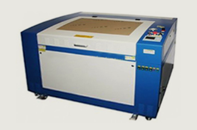
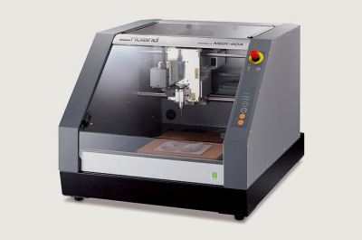
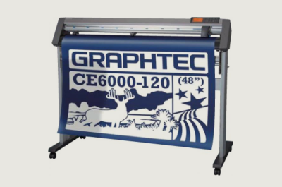
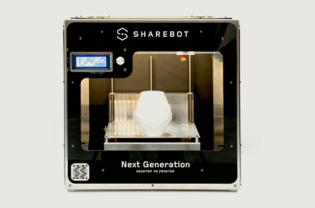
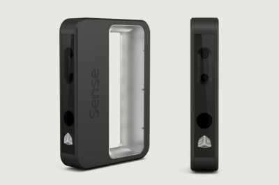

# Attrezzature

## LASER CUTTER

### Work Line 1290

- Work Area: 1200 x 900 x 500 mm
- Potenza: 120W Co2
- Materiali: organici e plastici, no metallici
- Formato: .dxf, .jpg; .png
- Utilizzi: lavorazioni e incisioni su legno, plexiglass, vetro e marmo; lavorazioni con stoffe, tessuti e pelle; realizzazione dime per strass; articoli promozionali (penne, matite, cucchiai, portachiavi), timbri, targhe e medagliette in alluminio…

## FRESA CNC

### Roland MDX-40

- Work Area: 305 x 305 x 105 mm
- Utensili: multiutensili
- Materiali: ABS, cere, resine, legno, legno chimico, acrilici, PVC e POM
- Formato: .dxf, .stl

## PLOTTER DA TAGLIO

### Graphtech

- Work Area: 1220 mm x 50 mt
- Pressione max di taglio: 50 gf
- Velocità max di taglio: 1000 mm/s
- Utensili: lama
- Materiali: vinile, cartoncino
- Formato: .dxf, .ai, .svg
- Utilizzi: Decorazioni per bici, auto e moto, cartelloni pubblicitari, adesivi per caschi, vetrofanie, banner…

## STAMPANDE 3D

### Sharebot NG

- Work Area: 250 x 200 x 200 mm
- Materiali: Filamenti da 1.75 mm: PLA, TPU, PET, Nylon, - Polystyrene, Cristal Flex
- Utilizzi: ideale per prototipi o oggetti di medie dimensioni.

## SCANNER 3D

### 3D Sense

- SO: Windows 7 +, Mac IOS 10.8 +
- Interfaccia: USB 2.0 e 3.0
- Area di scan: Min: 0.2 x 0.2 x 0.2 m; Max: 3 x 3 x 3 m
- Utilizzi: ideale per ottenere velocemente una rappresentazione 3d modificabile.

## POSTAZIONE ELETTRONICA

### Arduino - Raspberry - Utensili

- Strumenti: stazione di elettronica, saldatore professionale, Arduino, Raspberry
- Utilizzi: Ideale per realizzare prodotti o prototipi di dispositivi elettronici